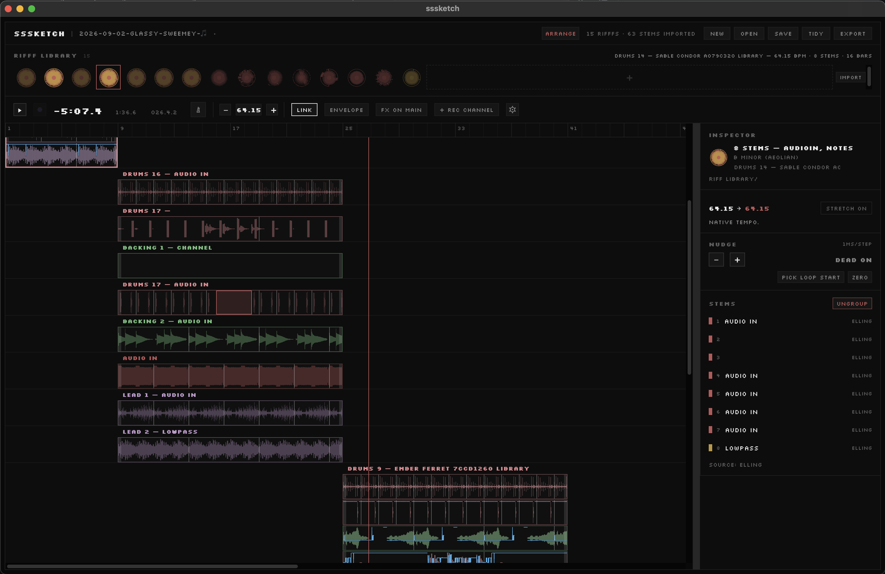

# sssketch

The idea behind sssketch is to simplify the process of exporting rifffs from [Endlesss](https://endlesss.fm/), making arrangements, and exporting files that are easy to deal with in a full DAW.

For the moment it's a desktop app for macOS built on Electron and with a real-time native
audio engine (JUCE) running underneath for playback and (basic) plugin hosting.

**Status:** early beta. Expect rough edges — see [Known issues](#known-issues) below.

This app isn't affiliated with or endorsed by Endlesss or Hablab London. Use at your own risk.

AI disclosure: this codebase is AI-assisted. See [AI_DISCLOSURE.md](AI_DISCLOSURE.md).

## Getting your audio in

Two ways to bring stems into a project:

- **Drag and drop** — drag a collection of stems directly into a project library (from Endlesss or ... wherever, though Endlesss audio is the only audio we've been testing with.)
- **Log into Endlesss** — click "import" and sign in with your Endlesss account to
  browse your shared feed or private jams directly.

## The basic ideas

- **tidy up** — this idea is to semi-automatically group similar-sounding stems onto shared buses, using audio analysis so an arrangement doesn't turn into dozens of overlapping tracks. The machine guesses and the user approves or tells it to try another go.
- **re-one tool** - when you import a rifff or a collection of rifffs, you'll be presented with a screen to find the beginning of the loop. For short ones, find the first downbeat. For longer ones, find the beginning of the looped phrase. sssketch will 'rotate' the audio within the app without affecting the downloaded audio.
- **sketch and arranger modes** — sketch is the default mode, and it's meant to be a simple linear arrangement view for sequencing a collection of rifffs. you can change the number of bars by right-clicking and dragging on the riff(s) (to select multiple rifffs, hold cmd or shift.) the idea is to sketch out a flow before switching to the full "arranger" mode to fine-tune it a bit more.
- **tempo** - the first rifff you drag into the project will set the tempo
- **Various DAW exports** — writes real app project files for Ableton Live 12 and REAPER, with the tidied bus groupings mapped onto tracks and colors. You can also export stems of the tidied buses too.

## Installing

Grab the latest `.dmg` for your Mac from the [Releases page](../../releases/latest):

- **sssketch-X.Y.Z.dmg** — Apple Silicon (M1/M2/M3/M4)
- **sssketch-X.Y.Z-x64.dmg** — Intel

Not sure which you have? Apple menu → About This Mac — it lists the chip.

Drag `sssketch.app` from the `.dmg` into Applications to install. The app is signed and
notarized, so Gatekeeper should open it normally after you approve opening an app downloaded from the internet.

**Uninstalling:** drag `sssketch.app` to the Trash. Your saved sketches live in `~/Music/sssketch` (or wherever you chose on first launch) and
aren't touched; delete that folder too if you want them gone. App preferences and caches live
in `~/Library/Application Support/sssketch`.

## Known issues

- Audio recording feels buggy as hell. I just wanted to see if I could add it really, but right now it's not very fun to use yet.
- Not all plugins will work, and they definitely won't stick in any exports beyond stem and mix audio. Best to use them sparingly until you can use a full DAW.

[open an issue](../../issues) if you hit something.

## Acknowledgments

[Endlesss](https://endlesss.fm/) rules. When I first downloaded it to my phone in 2020 it changed my relationship with music for the better, instantly connected me with a world of amazing people, and finally made me think of myself as a musician. Thank you to Tim Exile and the Endlesss team
for building it, and thank you to Imogen Heap and Hablab London for resuscitating it after the closure.

sssketch would not exist without [OUROVEON](https://github.com/OUROcorp/OUROVEON), an
open-source toolkit for the Endlesss ecosystem created by @ishani. There is no published API for Endlesss — ishani and the OUROVEON team reverse-engineered the backend from scratch, and released that work openly. sssketch's Endlesss integration doesn't just take general inspiration from that; specific, named parts of it were read directly from OUROVEON's own source and reproduced or ported:

- **Login and session handling** — the login endpoint, request/response shape, and how the returned token/password pair authenticates two different ways (Basic auth for CouchDB calls, Bearer for REST calls) are traced from OUROVEON's `ouro.cpp`, `config.h`, and `api.cpp`.
- **Shared feed, jam, and riff listing** — the CouchDB endpoints and views sssketch calls, including a quirk where the feed response can contain literal `null` entries that need filtering out, come straight from OUROVEON's own client.
- **Stem downloading** — URL reconstruction (never trusting the embedded `url` field), retry/backoff timing, and CDN fetch headers all match OUROVEON's `Stem::fetch()`/`attemptRemoteFetch` behavior.
- **BPM rounding, root/scale names, and instrument-type detection** — sssketch uses OUROVEON's own formulas and constants directly (from `core.constants.h` and `toolkit.warehouse.cpp`), so the values it shows agree with the official client.
- **The loop-seam declick fade** in sssketch's native audio engine is a direct port of OUROVEON's `Stem::applyLoopSewingBlend`, including its exact tuning.
- **The riff library database** sssketch builds and syncs for itself is schema-compatible with OUROVEON's own LORE warehouse, and its sync design is modeled on OUROVEON's task-queue approach (not a literal code port). sssketch can also open an existing OUROVEON/LORE-synced `warehouse.db3` directly, read-only, if you already have one.

None of this would have been possible without OUROVEON having done that reverse-engineering work first and shared it.

**Shared Features**

- **Audio Engine**
  - Real-time playback, device I/O, and VST3/AU plugin hosting via [JUCE](https://juce.com/)
  - Tempo sync with other apps/devices via [Ableton Link](https://github.com/Ableton/link)
  - Stem time-stretching via [Rubberband](https://breakfastquay.com/rubberband/)

- **App Shell**
  - Desktop app shell via [Electron](https://www.electronjs.org/)
  - UI built with [React](https://react.dev/)
  - Local riff library database via [better-sqlite3](https://github.com/WiseLibs/better-sqlite3)
  - Ableton Live project export via [fast-xml-parser](https://github.com/NaturalIntelligence/fast-xml-parser)
  - Build, packaging, and auto-update tooling via [electron-vite](https://electron-vite.org/),
    [electron-builder](https://www.electron.build/), and
    [electron-updater](https://www.electron.build/auto-update)

## License

[GPL-3.0-or-later](LICENSE).
