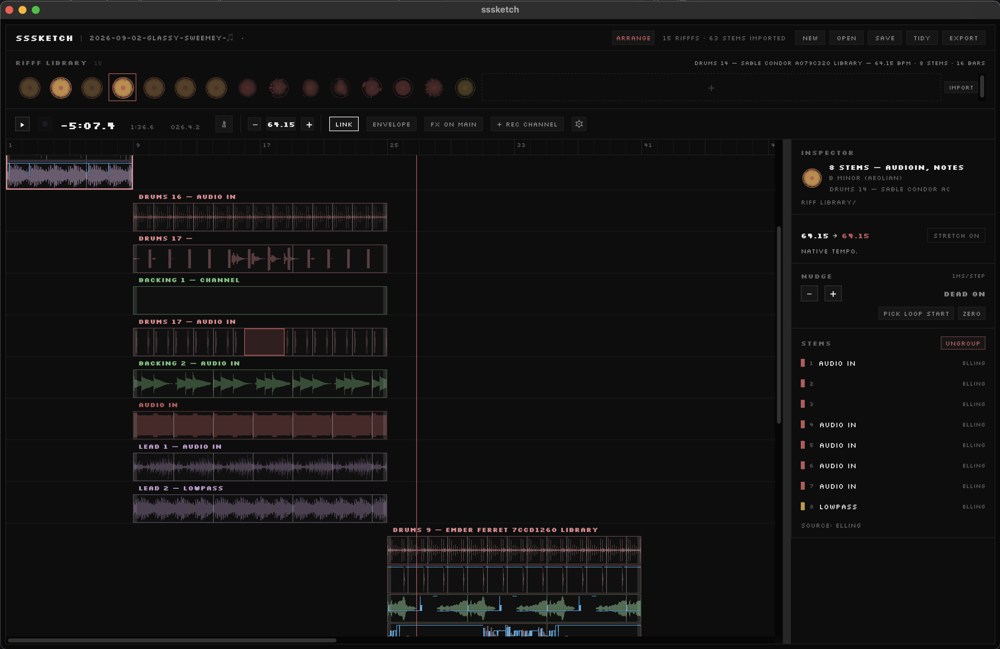

# sssketch

The idea behind sssketch is to simplify the process of exporting rifffs from [Endlesss](https://endlesss.fm/), making arrangements, and exporting files that are easy to deal with in a full DAW.

For the moment it's a desktop app for macOS built on Electron and with a real-time native
audio engine (JUCE) running underneath for playback and (basic) plugin hosting.

**Status:** early beta. Expect rough edges — see [Known issues](#known-issues) below.

This app isn't affiliated with or endorsed by Endlesss or Hablab London. Use at your own risk.

AI disclosure: this codebase is AI-assisted. See [AI_DISCLOSURE.md](AI_DISCLOSURE.md).

## What you need

- **A Mac** running macOS 12 (Monterey) or newer. Both kinds of chip work: Apple Silicon and Intel each have their own download (see [Installing](#installing)).
- **An Endlesss account**, really. You can drag any stems in without one, but importing, discover and radio all work from your riff library, and the easy way to fill that is to log into Endlesss and sync your jams.
- **LORE** is optional. If you already have an [OUROVEON](https://github.com/OUROcorp/OUROVEON) LORE archive of your jams, sssketch can read it directly: gear menu → `change riff archive location…`, then pick the archive folder (the one with `cache/common/warehouse.db3` inside; if you pick a folder one level off, sssketch finds it). `use sssketch's own library` in the same menu switches back.

## Getting your audio in

Two ways to bring stems into a project:

- **Drag and drop** — drag a collection of stems directly into a project library (from Endlesss or ... wherever, though Endlesss audio is the only audio we've been testing with.)
- **Log into Endlesss** — click "import" and sign in with your Endlesss account to
  browse your shared feed or private jams directly. The first time, sssketch asks before it syncs your shared feed and your own jam, because downloading all that audio can take a lot of space. Other jams sync when you press their sync button.

## The basic ideas

- **tidy up** — this idea is to semi-automatically group similar-sounding stems onto shared buses, using audio analysis so an arrangement doesn't turn into dozens of overlapping tracks. The machine guesses and the user approves or tells it to try another go. It's also where you say what each stem actually is, which the arranger, discover and the map all read back; `tidy up library` runs the same pass over your whole riff library rather than one sketch.
- **re-one tool** - when you import a rifff or a collection of rifffs, you'll be presented with a screen to find the beginning of the loop. For short ones, find the first downbeat. For longer ones, find the beginning of the looped phrase. sssketch will 'rotate' the audio within the app without affecting the downloaded audio.
- **three views of one arrangement** — sketch, arrange and map are three ways of looking at the same clips; Tab, or the button in the top bar, cycles them. sketch is the default and is meant to be a simple linear arrangement view for sequencing a collection of rifffs. you can change the number of bars by right-clicking and dragging on the riff(s) (to select multiple rifffs, hold cmd or shift.) the idea is to sketch out a flow before switching to the full "arrange" view to fine-tune it a bit more.
- **tempo** - the first rifff you drag into the project will set the tempo
- **the arrangement map** — the third of those views: rows down the side, sections across the top, one cell per time round the loop. Clicking a cell edits the real clips, so it's a zoomed-out way of working rather than a separate thing to keep in sync.
- **sssketchy** — a small pixel character who walks you from a loop to a rough track: name what the loop is, pick a shape, and he lays out a map you can edit, then offers sweeps, fades and risers at the joins. He suggests goals rather than giving instructions, and everything he makes is ordinary clips and curves you can move or undo. Still new and rough.
- **a built-in sound toolkit** — a filter sweep, a reverb send and a volume curve per clip, drawn by hand in an automation lane you show over the arrange view with the transport bar's automation button, plus white-noise risers you drag out to whatever length you want. On export you choose: bake them into the audio, or send them out as real automation on the DAW's own stock devices.
- **Various DAW exports** — writes real app project files for Ableton Live 12 and REAPER, with the tidied bus groupings mapped onto tracks and colors. You can also export stems of the tidied buses too.

## Discover and radio

- **discover** rolls up a handful of stems from your riff library that should work together: same tempo, a sensible mix of drums, bass and the rest. Hold the ones you like, reroll the rest, and add the result to the timeline or keep it for later. The `source` dial chooses between Endlesss's built-in instruments and your own recorded sounds (half and half to start).
- **radio** is discover on a clock: it keeps playing and swaps one layer at a time at the end of each loop, so it slowly drifts through your library. Good for finding combinations you'd never have picked by hand.

Both only draw from your riff library. Stems you drag in, or import from a loop folder, go straight to the timeline instead. If your library is empty, both say so and point you at the ways to fill it.

The first time you open discover it asks whether it may analyse your whole library in the background so it can find better matches. That analysis runs on your Mac; nothing is sent anywhere.

## Advanced features

sssketch has a few extras most people won't need, so they start switched off. Turn them on from the gear menu: `advanced features: on`. Switching off hides them again without deleting anything.

- **plugins** — VST3 and Audio Unit effects on the master and on each channel. sssketch looks for them in `/Library/Audio/Plug-Ins` and in your own `~/Library/Audio/Plug-Ins`.
- **recording** — record from your audio input straight into a project. macOS asks for microphone permission the first time.
- **phone remote** — control discover and radio from your phone's browser. Your phone and Mac need to be on the same Wi-Fi; the Mac shows an address, a QR code and a four-character pairing code. macOS may ask whether to allow incoming connections: say yes. Playback stays on the Mac; the paired phone is sent the stems of the loop that's playing, and nothing else. Some routers (especially guest and mesh networks) stop devices on the same Wi-Fi from talking to each other; if the phone can't connect, a VPN like [Tailscale](https://tailscale.com/) on both works around it.
- **sound defaults** — the starting sound settings for new projects.
- **hearts key** — only for the web radio at ell.ing, so you can ignore this one.

## Where your stuff lives

- **`~/Music/sssketch`** — your saved sketches (unless you chose another place on first launch), and `library/`, the riff library database that the Endlesss sync fills in.
- **`~/Library/Application Support/sssketch`** — app settings, caches, and the audio of every synced riff (`endlesss-cache`). This is the one that can get big: an active Endlesss account can mean many gigabytes.

## What goes over the network

sssketch has no accounts of its own, no analytics and no crash reporting. It only talks to:

- **Endlesss**, while you're logged in: to log in, list your jams and riffs, and download the audio of the riffs you sync. Your password is never stored, only the session Endlesss gives back, encrypted by macOS.
- **GitHub**, to check for a new version of sssketch: when the app starts and every few hours after. It sends nothing about you beyond a normal web request, and it asks before downloading an update.
- **ell.ing**, only if you've entered a hearts key and press `fetch hearts`. Without a key, nothing is sent.
- **Your own phone**, if you turn the phone remote on (advanced features). It only listens on your local network, only while it's on, and only answers a phone that has typed the pairing code.

## Exporting

Three items in the project menu, for three different jobs.

**export mix** — one stereo file of the whole arrangement. For sending someone a rough.

**export stems** — asks how you want them split:

- **mixed by bus** — one file per tidied bus, so a drums bus with four stems in it comes out as one drums file. Fewer, bigger files.
- **individual tracks** — one file per stem, nothing summed.

Every file starts at bar one and runs the full length of the arrangement, so they line up when you drop them anywhere.

**export project…** — a real Ableton Live 12 or REAPER project, with your tidied buses as tracks and their colours carried across.

### What happens to the filter, reverb, volume curves and risers

If you've used the built-in toolkit, a project export asks one more question:

- **bake it into the audio** *(default)* — the audio you export already has the sweeps, sends and curves printed into it. What you hear in sssketch is exactly what lands in the other DAW. The moves themselves are frozen; you can't reopen a sweep and change it over there.
- **export it as automation** — the audio goes out dry and the moves come across as real envelopes on the DAW's own stock devices: Ableton's Auto Filter and a Reverb return, REAPER's ReaEQ and send envelopes. Fully editable, but it's their filter and their reverb, so it won't sound identical to ours.

Risers always come out as rendered audio either way — there's no stock device that generates one.

Plugins are the one thing no export carries. Stem and mix audio include whatever a plugin did; a DAW project doesn't, so use them sparingly until you're in the other DAW.

## Installing

Latest version: **1.5.0**

- [**sssketch-1.5.0-arm64.dmg**](https://github.com/ellinglien/sssketch/releases/download/v1.5.0/sssketch-1.5.0-arm64.dmg) — Apple Silicon (M1/M2/M3/M4)
- [**sssketch-1.5.0-x64.dmg**](https://github.com/ellinglien/sssketch/releases/download/v1.5.0/sssketch-1.5.0-x64.dmg) — Intel

### Which file do I download?

- **Intel** → download the file with `-x64` in the name.
- **Chip: Apple M1** (or M2, M3, M4 — any Apple chip) → download the one **without** `-x64` in the name.
- Not sure, rule of thumb: Older Mac (roughly 2020 or earlier) likely Intel. Newer ones use the M chip.

Picked wrong by accident? No harm done — it just won't open, and you can grab the other one. To check for sure: Apple menu → About This Mac lists the chip.

Older versions, and the notes for each, are on the [Releases page](../../releases).

Drag `sssketch.app` from the `.dmg` into Applications to install. The app is signed and
notarized, so Gatekeeper should open it normally after you approve opening an app downloaded from the internet.

**Uninstalling:** drag `sssketch.app` to the Trash. That leaves your stuff where it is (see [Where your stuff lives](#where-your-stuff-lives)): delete `~/Music/sssketch` if you want your sketches and riff library gone, and `~/Library/Application Support/sssketch` for the settings and the synced audio, which is usually the big one.

## Known issues

- Audio recording feels buggy as hell. I just wanted to see if I could add it really, but right now it's not very fun to use yet.
- Not all plugins will work, and they definitely won't stick in any exports beyond stem and mix audio. Best to use them sparingly until you can use a full DAW.

[open an issue](../../issues) if you hit something.

## Acknowledgments

[Endlesss](https://endlesss.fm/) rules. When I first downloaded it to my phone in 2020 it changed my relationship with music for the better, instantly connected me with a world of amazing people, and finally made me think of myself as a musician. Thank you to Tim Exile and the Endlesss team
for building it, and thank you to Imogen Heap and Hablab London for resuscitating it after the closure.

sssketch would not exist without [OUROVEON](https://github.com/OUROcorp/OUROVEON), an
open-source toolkit for the Endlesss ecosystem created by @ishani. There is no published API for Endlesss — ishani and the OUROVEON team reverse-engineered the backend from scratch, and released that work openly. sssketch's Endlesss integration doesn't just take general inspiration from that; specific, named parts of it were read directly from OUROVEON's own source and reproduced or ported:

- **Login and session handling** — the login endpoint, request/response shape, and how the returned token/password pair authenticates two different ways (Basic auth for CouchDB calls, Bearer for REST calls) are traced from OUROVEON's `ouro.cpp`, `config.h`, and `api.cpp`.
- **Shared feed, jam, and riff listing** — the CouchDB endpoints and views sssketch calls, including a quirk where the feed response can contain literal `null` entries that need filtering out, come straight from OUROVEON's own client.
- **Stem downloading** — URL reconstruction (never trusting the embedded `url` field), retry/backoff timing, and CDN fetch headers all match OUROVEON's `Stem::fetch()`/`attemptRemoteFetch` behavior.
- **BPM rounding, root/scale names, and instrument-type detection** — sssketch uses OUROVEON's own formulas and constants directly (from `core.constants.h` and `toolkit.warehouse.cpp`), so the values it shows agree with the official client.
- **The loop-seam declick fade** in sssketch's native audio engine is a direct port of OUROVEON's `Stem::applyLoopSewingBlend`, including its exact tuning.
- **The riff library database** sssketch builds and syncs for itself is schema-compatible with OUROVEON's own LORE warehouse, and its sync design is modeled on OUROVEON's task-queue approach (not a literal code port). sssketch can also open an existing OUROVEON/LORE-synced `warehouse.db3` directly, read-only, if you already have one.

None of this would have been possible without OUROVEON having done that reverse-engineering work first and shared it.

**Shared Features**

- **Audio Engine**
  - Real-time playback, device I/O, and VST3/AU plugin hosting via [JUCE](https://juce.com/)
  - Tempo sync with other apps/devices via [Ableton Link](https://github.com/Ableton/link)
  - Stem time-stretching via [Rubberband](https://breakfastquay.com/rubberband/)
  - Built-in reverb via [zita-rev1](https://github.com/PelleJuul/zita-rev1) — Fons
    Adriaensen's FDN reverb, vendored unmodified (GPL-3.0-or-later, same as this repo) under
    `native-engine/Source/dsp/zita-rev1/`; see that folder's `VENDORED.md`

- **App Shell**
  - Desktop app shell via [Electron](https://www.electronjs.org/)
  - UI built with [React](https://react.dev/)
  - Local riff library database via [better-sqlite3](https://github.com/WiseLibs/better-sqlite3)
  - Ableton Live project export via [fast-xml-parser](https://github.com/NaturalIntelligence/fast-xml-parser)
  - Build, packaging, and auto-update tooling via [electron-vite](https://electron-vite.org/),
    [electron-builder](https://www.electron.build/), and
    [electron-updater](https://www.electron.build/auto-update)

## License

[GPL-3.0-or-later](LICENSE).
